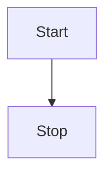

# Getting Started

[[toc]]

## Vitepress Init

### Installation

VitePress can be used on its own, or be installed into an existing project. In both cases, you can install it with:

```shell
pnpm add -D vitepress
```

### Setup Wizard

VitePress ships with a command line setup wizard that will help you scaffold a basic project. After installation, start the wizard by running:

```shell
pnpm vitepress init
```

You will be greeted with a few simple questions:

```shell
┌  Welcome to VitePress!
│
◇  Where should VitePress initialize the config?
│  ./docs
│
◇  Site title:
│  My Awesome Project
│
◇  Site description:
│  A VitePress Site
│
◆  Theme:
│  ● Default Theme (Out of the box, good-looking docs)
│  ○ Default Theme + Customization
│  ○ Custom Theme
└
```

### Up and Running

The tool should have also injected the following npm scripts to your package.json if you allowed it to do so during the setup process:

```json
{
  ...
  "scripts": {
    "docs:dev": "vitepress dev docs",
    "docs:build": "vitepress build docs",
    "docs:preview": "vitepress preview docs"
  },
  ...
}
```

The docs:dev script will start a local dev server with instant hot updates. Run it with the following command:

```shell
pnpm run docs:dev
```

or

```shell
pnpm vitepress dev docs
```

## Useful Support

### Markdown Math Support

This is currently opt-in. To enable it, you need to install `markdown-it-mathjax3` and set `markdown.math` to `true` in your config file:

```shell
pnpm add -D markdown-it-mathjax3
```

```ts
// .vitepress/config.ts
export default {
  markdown: {
    math: true
  }
}
```

### Mermaid Support

Install the [vitepress-plugin-mermaid](https://github.com/emersonbottero/vitepress-plugin-mermaid).

```shell
pnpm add -D vitepress-plugin-mermaid mermaid

pnpm install --shamefully-hoist 
```

Add wrapper in `config.mts`:

```ts
// .vitepress/config.js
import { withMermaid } from "vitepress-plugin-mermaid";

export default withMermaid({
  // your existing vitepress config...
  mermaid:{
    //mermaidConfig !theme here works for ligth mode since dark theme is forced in dark mode
  },
  ...
});
```

Use in any Markdown file

```
<!---any-file.md-->

flowchart TD
  Start --> Stop
```



See the [docs 📕](https://emersonbottero.github.io/vitepress-plugin-mermaid/)
and a [complex example 😎](https://emersonbottero.github.io/vitepress-plugin-mermaid/guide/more-examples.html#render)

## Deploy

### Build and Test Locally

1. Run this command to build the docs:

```shell
pnpm run docs:build
```

2. Once built, preview it locally by running:

```shell
pnpm run docs:preview
```

The preview command will boot up a local static web server that will serve the output directory .vitepress/dist at http://localhost:4173. You can use this to make sure everything looks good before pushing to production.

3. You can configure the port of the server by passing `--port` as an argument.

```json
{
  "scripts": {
    "docs:preview": "vitepress preview docs --port 8080"
  }
}
```

### Setting a Public Base Path

By default, we assume the site is going to be deployed at the root path of a domain (/). If your site is going to be served at a sub-path, e.g. https://mywebsite.com/blog/, then you need to set the base option to '/blog/' in the VitePress config.

Example: If you're using Github (or GitLab) Pages and deploying to user.github.io/repo/, then set your base to /repo/.

### Github Pages

1. Create a file named `deploy.yml` inside `.github/workflows` directory of your project with some content like this:

```yaml
# 构建 VitePress 站点并将其部署到 GitHub Pages 的示例工作流程
#
name: Deploy VitePress site to Pages

on:
  # 在针对 `main` 分支的推送上运行。如果你
  # 使用 `master` 分支作为默认分支，请将其更改为 `master`
  push:
    branches: [main]

  # 允许你从 Actions 选项卡手动运行此工作流程
  workflow_dispatch:

# 设置 GITHUB_TOKEN 的权限，以允许部署到 GitHub Pages
permissions:
  contents: read
  pages: write
  id-token: write

# 只允许同时进行一次部署，跳过正在运行和最新队列之间的运行队列
# 但是，不要取消正在进行的运行，因为我们希望允许这些生产部署完成
concurrency:
  group: pages
  cancel-in-progress: false

jobs:
  # 构建工作
  build:
    runs-on: ubuntu-latest
    steps:
      - name: Checkout
        uses: actions/checkout@v4
        with:
          fetch-depth: 0 # 如果未启用 lastUpdated，则不需要
      - uses: pnpm/action-setup@v3 # 如果使用 pnpm，请取消注释
        with:
            version: 9
      # - uses: oven-sh/setup-bun@v1 # 如果使用 Bun，请取消注释
      - name: Setup Node
        uses: actions/setup-node@v4
        with:
          node-version: 20
          cache: pnpm # 或 pnpm / yarn
      - name: Setup Pages
        uses: actions/configure-pages@v4
      - name: Install dependencies
        run: pnpm install # 或 pnpm install / yarn install / bun install
      - name: Build with VitePress
        run: pnpm run docs:build # 或 pnpm docs:build / yarn docs:build / bun run docs:build
      - name: Upload artifact
        uses: actions/upload-pages-artifact@v3
        with:
          path: docs/.vitepress/dist

  # 部署工作
  deploy:
    environment:
      name: github-pages
      url: ${{ steps.deployment.outputs.page_url }}
    needs: build
    runs-on: ubuntu-latest
    name: Deploy
    steps:
      - name: Deploy to GitHub Pages
        id: deployment
        uses: actions/deploy-pages@v4
```

::: warning
Make sure the `base` option in your VitePress is properly configured. See Setting a Public Base Path for more details.
:::

2. In your repository's settings under "Pages" menu item, select "GitHub Actions" in "Build and deployment > Source".

3. Push your changes to the `main` branch and wait for the GitHub Actions workflow to complete. You should see your site deployed to `https://<username>.github.io/[repository]/` or `https://<custom-domain>/` depending on your settings. Your site will automatically be deployed on every push to the main branch.

### Nginx

Here is a example of an Nginx server block configuration. This setup includes gzip compression for common text-based assets, rules for serving your VitePress site's static files with proper caching headers as well as handling `cleanUrls: true`.

```nginx
server {
    gzip on;
    gzip_types text/plain text/css application/json application/javascript text/xml application/xml application/xml+rss text/javascript;

    listen 80;
    server_name _;
    index index.html;

    location / {
        # content location
        root /app;

        # exact matches -> reverse clean urls -> folders -> not found
        try_files $uri $uri.html $uri/ =404;

        # non existent pages
        error_page 404 /404.html;

        # a folder without index.html raises 403 in this setup
        error_page 403 /404.html;

        # adjust caching headers
        # files in the assets folder have hashes filenames
        location ~* ^/assets/ {
            expires 1y;
            add_header Cache-Control "public, immutable";
        }
    }
}
```

This configuration assumes that your built VitePress site is located in the `/app` directory on your server. Adjust the `root` directive accordingly if your site's files are located elsewhere.

::: warning
Do not default to index.html

The try_files resolution must not default to index.html like in other Vue applications. This would result in an invalid page state.
:::
